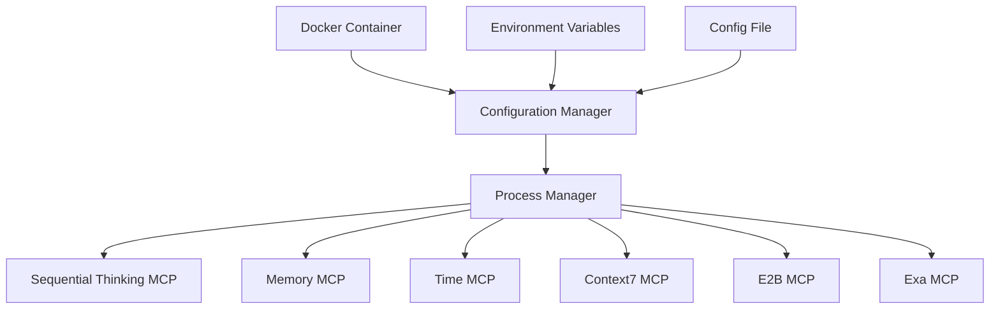

# Design Document

## Overview

This design document outlines the architecture and implementation details for a comprehensive Docker-based MCP (Model Context Protocol) server setup. The solution will consolidate multiple MCP servers into a single deployable container, including sequential-thinking, memory, time, context7, e2b, and exa servers. The design focuses on creating a unified, containerized environment with proper configuration management, environment variable handling, and dependency management.

## Architecture

The architecture follows a multi-service container pattern where a single Docker container hosts multiple MCP servers. Each MCP server runs as a separate process within the container, managed by a central configuration system. The container will be built on a Python base image with additional Node.js support to accommodate both Python and JavaScript-based MCP servers.



## Components and Interfaces

### Base Container

- **Python 3.11 Slim Image**: Provides the foundation for running Python-based MCP servers
- **Node.js Runtime**: Added to support JavaScript-based MCP servers
- **UV Package Manager**: For Python package management
- **NPM/NPX**: For Node.js package management

### MCP Servers

1. **Sequential Thinking MCP**
   - JavaScript-based server using NPX
   - Configuration via JSON

2. **Memory MCP**
   - JavaScript-based server using NPX
   - Configuration via JSON

3. **Time MCP**
   - Python-based server using UVX
   - Configurable timezone parameter

4. **Context7 MCP**
   - JavaScript-based server using NPX
   - Documentation retrieval capabilities

5. **E2B MCP**
   - Python-based server using UVX
   - Requires E2B_API_KEY for authentication

6. **Exa MCP**
   - JavaScript-based server using NPX
   - Requires EXA_API_KEY for authentication
   - Web search capabilities

### Configuration System

- **Unified JSON Configuration**: Single configuration file for all MCP servers
- **Environment Variable Integration**: Support for injecting API keys and other sensitive data
- **Validation Layer**: Ensures all required configuration is present before starting servers

## Data Models

### Configuration Schema

```json
{
  "mcpServers": {
    "server-name": {
      "command": "string",
      "args": ["string"],
      "env": {
        "ENV_VAR": "value"
      },
      "disabled": false
    }
  },
  "proxy": {
    "port": 8000,
    "host": "0.0.0.0"
  }
}
```

### Environment Variables

- `E2B_API_KEY`: Required for E2B MCP server authentication
- `EXA_API_KEY`: Required for Exa MCP server authentication
- `CONFIG_PATH`: Optional path to configuration file (default: `/app/config.json`)

## Error Handling

1. **Configuration Validation**:
   - Validate configuration file format and required fields
   - Check for presence of required environment variables
   - Provide clear error messages for missing or invalid configuration

2. **Process Management**:
   - Monitor MCP server processes for crashes or failures
   - Implement restart policies for failed processes
   - Log process output for debugging

3. **Resource Management**:
   - Handle resource allocation between MCP servers
   - Implement graceful degradation when resources are constrained

## Testing Strategy

1. **Unit Testing**:
   - Test configuration validation logic
   - Test environment variable handling

2. **Integration Testing**:
   - Test each MCP server initialization
   - Verify proper communication between components

3. **System Testing**:
   - Test the complete container with all MCP servers running
   - Verify proper handling of configuration changes
   - Test container restart and recovery

4. **Performance Testing**:
   - Measure resource usage with all MCP servers running
   - Test under various load conditions

## Deployment Considerations

1. **Container Size Optimization**:
   - Use multi-stage builds to reduce final image size
   - Include only necessary dependencies

2. **Security**:
   - Avoid hardcoding sensitive information
   - Run container with minimal privileges
   - Use environment variables for secrets

3. **Monitoring**:
   - Implement health checks for container and individual MCP servers
   - Provide structured logging for observability

4. **Scalability**:
   - Design for potential horizontal scaling in future versions
   - Optimize resource usage for efficient operation